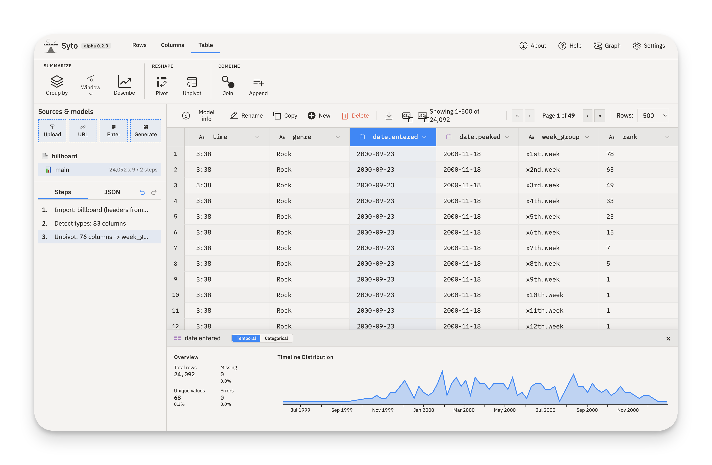

# Syto — Data Wrangling in the Browser

Syto is a browser-based tool for cleaning and transforming tabular data. Think Power Query, but runs anywhere — no installation, no accounts, no data leaving your machine.

**Who it's for**: students, analysts, and anyone who needs to clean and perform EDA on tabular data without writing code or installing software.



## What it does

- **Import** CSV, JSON, Excel, or paste from clipboard
- **Transform** with a visual pipeline builder — filter, derive, aggregate, join, reshape, replace, and more
- **Export** cleaned data as CSV/JSON, or save the workflow as a replayable JSON spec
- **Run headlessly** via CLI (`syto run workflow.json`)

Workflows are plain JSON, so you can inspect, diff, and version them like any other file.

## Quick start

```bash
npm install
npm run dev
```

Open `http://localhost:5173` and drop a CSV file onto the page.

### CLI

```bash
npm run build:cli
node dist-cli/cli.mjs run workflow.json --input data.csv
```

## Design principles

| Principle                 | In practice                                                                  |
| ------------------------- | ---------------------------------------------------------------------------- |
| **Local-first**           | All data stays in your browser. No uploads, no servers.                      |
| **Declarative pipelines** | Transformations are data (JSON), not code.                                   |
| **Beginner-friendly**     | Sensible defaults, no jargon. Advanced options are there when you need them. |

## Tech stack

| Layer         | Technology                             |
| ------------- | -------------------------------------- |
| Build         | Vite, TypeScript, Vitest               |
| UI            | Preact, Signals, CSS Modules           |
| Data          | Arquero (transforms), PapaParse (CSV)  |
| Expressions   | jsep (parsing), custom AST interpreter |
| Visualization | Vega-Lite                              |
| Storage       | IndexedDB, localStorage                |

## Development

```bash
npm run dev        # Dev server
npm run build      # Type-check + production build
npm test           # Run test suite
npm run typecheck  # Type-check only
```

See [AGENTS.md](AGENTS.md) for project overview and contributor onboarding, or [docs/SPECIFICATION.md](docs/SPECIFICATION.md) for full technical architecture.

## Feedback

Found a bug or have a feature idea? [Open an issue](https://github.com/ptrvtch/syto/issues). Pull requests are not accepted — describe what you'd like and I'll take it from there.

## How it's made

Built by a data analyst with [Claude Code](https://claude.ai/claude-code) doing most of the heavy lifting — expect solid data transformations and some rough edges on the UI.

## License

[MIT](LICENSE)
